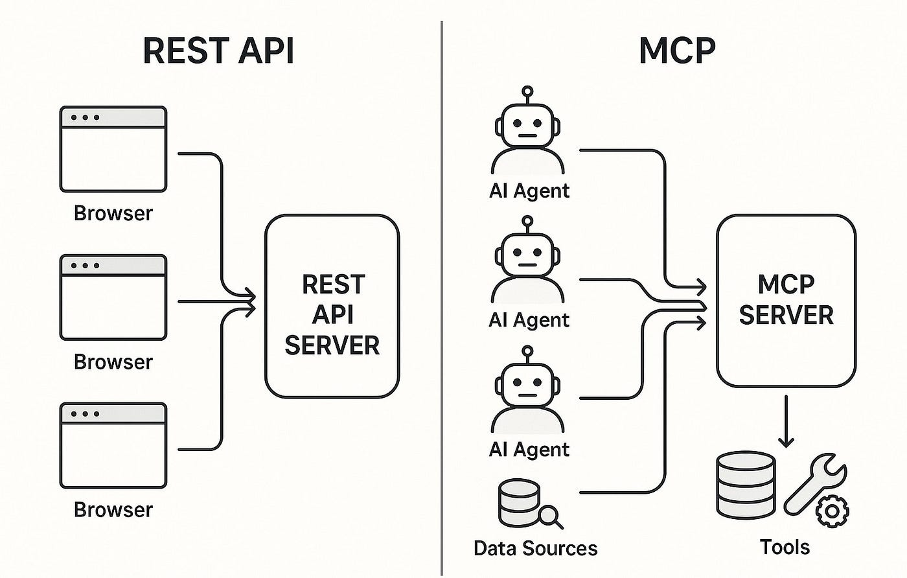

# Clase 04 - IA para programdores

## IA para generar música a una canción

<https://suno.com/>

## IA para generación de imagenes

Herramienta para generar imagenes que permite generar una cierta cantidad de imagenes de forma gratuita por dia.

**Tip**:
    - En cualquier programa generador de imagenes se recomienda utilizar los prompts en ingles


* <https://designer.microsoft.com/>

```prompt
Friendly teacher surrounded by happy students, modern classroom, colorful flat illustration, education technology elements, laptops, coding on screens, smiling faces, clean banner composition, soft shadows, pastel colors, minimal background, space for headline text, high resolution, 16:9 cover image
```

* <https://leonardo.ai/>

```prompt
Create a thrilling and dynamic scene of skydivers in mid-air above a breathtaking landscape during golden hour, capturing the excitement, freedom, and adrenaline of skydiving. Include a diverse group of people in colorful jumpsuits and helmets, with clear skies, soft clouds, and the earth far below, emphasizing motion and exhilaration, cinematic lighting, high detail, realistic style, no text.
```  

* <https://ideogram.ai/t/explore>


# Herramientas para documentar proyectos de código fuente

* DeepWiki
    * Genera toda la documentación de un repositoiro de GitHub
    * Funciona con proyectos que están en GitHub.

* Deepwiki-open: 
    - Herramienta Open Source para instalar local
    - Generar documentación a partir de repos privados

<https://github.com/AsyncFuncAI/deepwiki-open>

Analisis de Requerimientos: Minutas de reuniones

### Herramientas para grabar reuniones y generar minutas

* <https://meetgeek.ai/es>
* <https://www.notta.ai/es>
* <https://otter.ai/>
* <https://tldv.io/es/>
* <https://tactiq.io/es>
* <https://read.ai>
* <https://grain.com/>

Estás herramientas tienen 2 modos de funcionamiento

* Cargar el video o el audio de la minuta o reunión para transcribirlo y generar notas
* Tomar las notas directamente de la reunión desde Meet, Webex, Zoom, Teams

### Extensión de chrome para transcribir y resumir videos

<https://chromewebstore.google.com/detail/youtube-transcript-summar/eelolnalmpdjemddgmpnmobdhnglfpje?hl=en&utm_source=ext_sidebar>

<https://videotranscriber.ai/>

# Model Context Protocol (MCP)

Model Context Protocol (MCP) es un estándar abierto diseñado para conectar herramientas, datos y servicios con modelos de inteligencia artificial de manera segura, consistente y extensible. MCP permite que los LLM interactúen con tu entorno (archivos, APIs, bases de datos, sistemas internos) mediante servidores llamados **MCP Servers**.



## ¿Por qué usar MCP?

* **Integración estandarizada**: Conecta herramientas y servicios de forma consistente.
* **Mayor productividad**: Permite que el modelo acceda directamente al contexto necesario para ayudarte.
* **Extensible**: Podés crear tus propios MCP servers o usar los existentes (filesystem, PostgreSQL, web browsing, etc.).
* **Seguro**: Sin exponer más permisos de los necesarios.

## ¿Qué es un MCP Server?

Un **MCP Server** es una herramienta que expone capacidades (read, write, list, query, etc.) a través del protocolo.
Los entornos compatibles (como GitHub Copilot Chat o Cursor) pueden conectarse automáticamente a los MCP Servers habilitados en tu espacio de trabajo.

Ejemplos populares:

* **Filesystem MCP Server** → permite al modelo navegar y manipular archivos.
* **Git MCP Server**
* **OpenAPI MCP Server**
* **PostgreSQL MCP Server**

### Trabajando con el MCP de GITHUB
Ejemplo sencillo de utilización del MCP de GitHub

<https://docs.github.com/en/copilot/how-tos/provide-context/use-mcp-in-your-ide/use-the-github-mcp-server>

1. Instalar la extensión de Copilot (GitHub.copilot-chat)

2. Abrir la paleta de comandos (Ctrl + Shift + P) - [Show All Commands]

3. Escribir **MCP: Add Server**

4. Elegir (HTTP o Server...) 

5. Colocar en el input -> 'https://api.githubcopilot.com/mcp/'

6. Coloca un identificador en el input

7. Global

8. Abren el chat de copilot

9. Ponen en modo agente

## Text to Speech (Texto a Voz)

## Texto pasar a Postcast

> <https://elevenlabs.io/>

### NaturalReaders

> <https://www.naturalreaders.com/>

* Les hace un OnBoarding....
* Es una muy buena opcion para soluciones rapida
* La capa gratuita es muy generosa.
* Puntuacion : 8/10
  * Las voces son mejorables pero para ser una herramietna con un margen gratuito amplio viene bastante bien 

> <https://ttsreader.com/es/>

# GROQ: Es una empresa de hardware (Diseñar sistemas para la ejecución de LLM)
Diseñan aceleradoras para inferencia de IA (LPU: Language Processing Unit)

Nos provee Modelos Open Source incluso nos da una Api Key

* LLaMA
* Mixtral
* Gemma
* Whisper

# Prueba de la API KEY de GROQ

1. Entrar al Colab <https://colab.research.google.com/>
2. Configurar el entorno (Entorno de ejecución > Cambiar... >) Tildar -> GPU T4
3. Instalar groq 

```sh
pip install groq
```

4. Importar

```py
from groq import Groq
```
4. Ejecutar el código

```py
from groq import Groq
api_key = input("Ingrese su Api Key")
prompt = input("Ingrese su prompt")

client = Groq(api_key=api_key)

chat_completion = client.chat.completions.create(
    messages=[
        {
            "role": "user",
            "content": prompt
        }
    ],
    model="moonshotai/kimi-k2-instruct",
    stream=False,
)

print(chat_completion.choices[0].message.content)
```

## Creamos un aplicación con interfaz gráfica

1. Instalamos gradio

```sh
pip install gradio
```

2. Ejecutamos el código

```py
import gradio as gr
from groq import Groq

# Variable global para almacenar la API key del usuario
client = None

def set_api_key(api_key):
    global client
    try:
        client = Groq(api_key=api_key)
        return "✅ API Key configurada correctamente"
    except Exception as e:
        return f"❌ Error al configurar la API Key: {e}"

def chatbot_interface(message, history):
    if not client:
        return "⚠️ Primero debes ingresar tu API Key arriba.", history

    try:
        # Construye el historial en el formato requerido por la API
        messages = [{"role": "user" if i % 2 == 0 else "assistant", "content": m} for i, (m, _) in enumerate(history)]
        messages.append({"role": "user", "content": message})

        response = client.chat.completions.create(
            messages=messages,
            model="groq/compound",
            stream=False,
        )
        reply = response.choices[0].message.content
        history.append((message, reply))
        return "", history
    except Exception as e:
        return f"❌ Error al conectar con Groq: {e}", history


# UI de Gradio
with gr.Blocks(title="Groq Chatbot") as demo:
    gr.Markdown("## 🤖 Chatbot con Groq API (Modelo Kimi K2)")

    with gr.Row():
        api_input = gr.Textbox(label="🔑 Ingresá tu API Key", type="password")
        set_key_btn = gr.Button("Guardar API Key")
        status_output = gr.Textbox(label="Estado", interactive=False)

    set_key_btn.click(fn=set_api_key, inputs=api_input, outputs=status_output)

    chatbot = gr.Chatbot(label="Chat estilo ChatGPT")
    msg = gr.Textbox(label="Escribí tu mensaje")
    send_btn = gr.Button("Enviar")

    send_btn.click(fn=chatbot_interface, inputs=[msg, chatbot], outputs=[msg, chatbot])

demo.launch()
```
